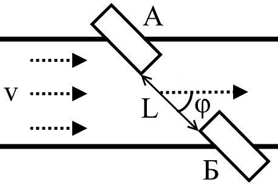

# Ultrasonic Water Flowmeter Based on Transit-Time Technique

## Brief

This is a battery powered waterflow meter project I did freelancing in 2015.

The measurement results are displayed on the LCD and are also sent to the PC. 

## How it works

> Ultrasonic time-pulse meters are based on sending ultrasonic signals to the acoustic channel. 

> These signals are sent upstream and downstream. For this purpose, two piezoceramic transducers directed at each other are used. Each of trandusers can work as a receiver and a transmitter.

> The signal propagation will be influenced by the flow flowing at a speed V. The propagation time of the signal from the upstream transmitter A to the downstream receiver B will be less than the propagation time of the signal from the downstream transmitter B to the upstream receiver A. Thus, the difference in time of flight between these two signals will be directly proportional to the flow rate V.

From: 
Realization of An Ultrasonic Water Flowmeter Based on Transit-Time Technique, Chizhov Nikolai, 2017.

## Equipment

Hardware:
 - STM32L100RB
 - TDC-GP22: Time to Digital Converter
 - LCD (custom model)
 - etc.
 
IDE: Keil uVision
